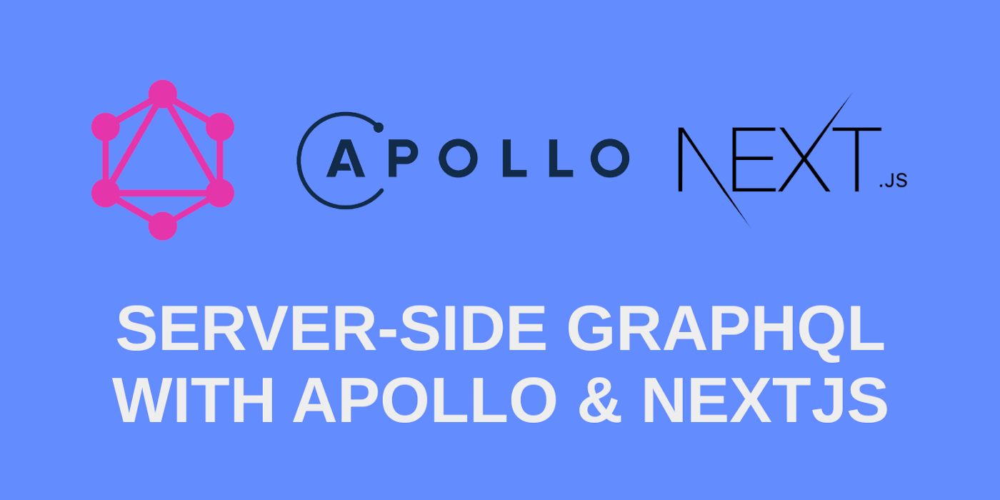

<h1 align="center">
  Project Next.js using Apollo Client
</h1>

<p align="center">
  
  
   
</p>

<p align="center">
  
</p>

## 💻 About this project

An example of how to configure the apollo client in a graphql project, using as request on the server side. In this example we are consuming a Graphql API of countries, and making a query to bring in data such as the name of the country, capital and phone prefix.
## :hammer: Technologies
This project was developed with the following Tools:
- **[TypeScript](https://www.typescriptlang.org/)**
- **[Next.js](https://nextjs.org/)**
- **[Apollo](https://www.apollographql.com/docs/react/)**


## 🚀 Run this project
```bash
# Clone this repository
$ git clone https://github.com/jefferson1104/nextjs-graphql-apollo.git

# Run this application
$ yarn dev

# Informations about GraphQL API
https://countries.trevorblades.com/

#Thanks!!!
```

## Project steps and notes
- [NOTES](./assets/NOTES.md)